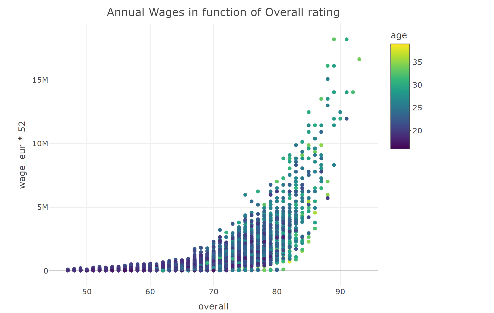
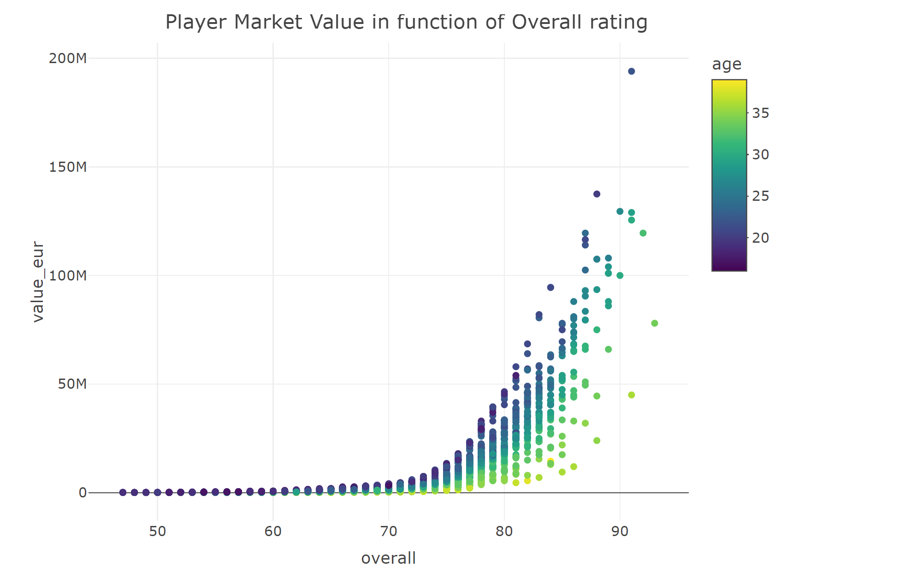
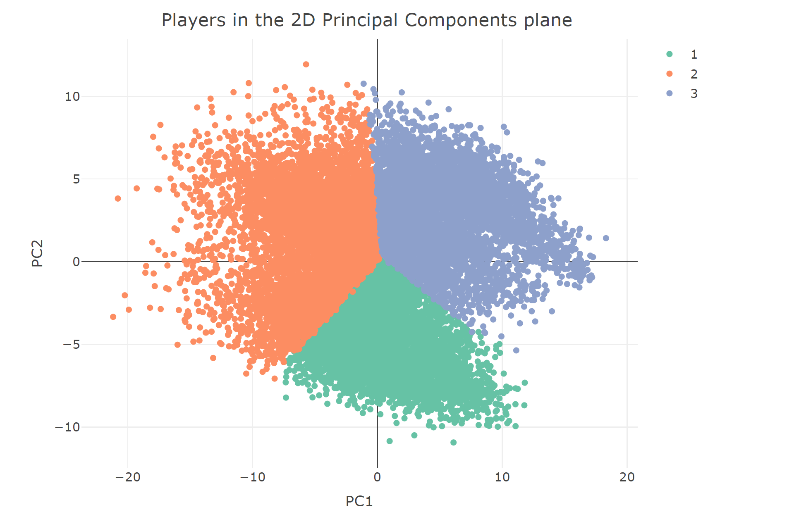
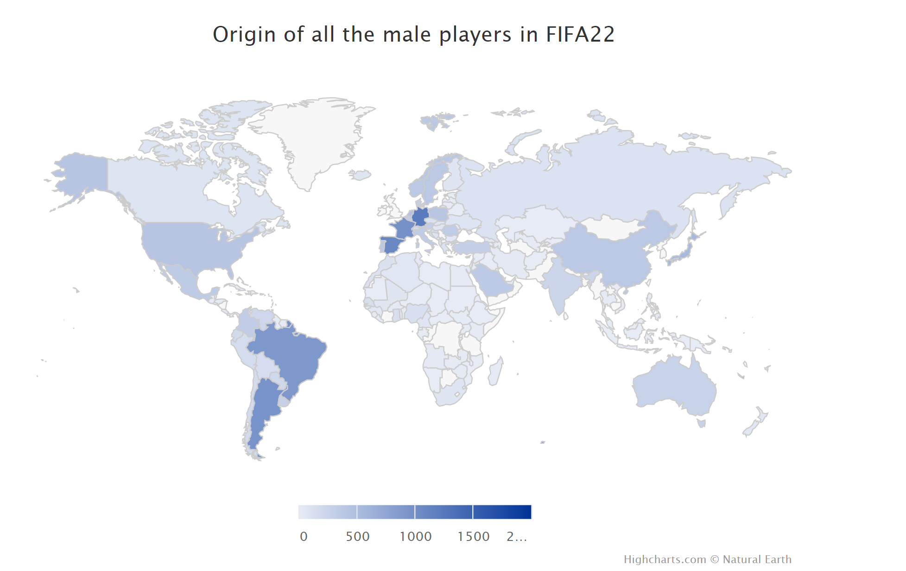
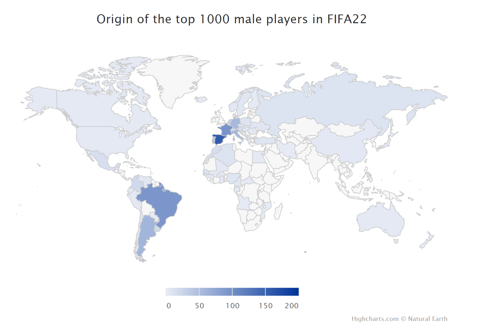

# Results

```{r load_libraries}
# load libraries 
library(tidyverse)
library(Lock5withR)
library(forcats)
library(RColorBrewer)
library(stringr)
library(ggridges)
library(ggalluvial)
```

## Analysis of Player Heights 

### Overall Distribution of Male and Female Heights 

We are first going to look at the overall distribution of players' heights for both male and female. We obviously expect the median height of the men to be larger than the median height of women. For this analysis, we will only use the most recent year of data we have, specifically 2022. 

```{r density_heights}
# make density plots 
all_players %>%
  filter(release_year == 2022) %>%
  ggplot(aes(x = height_cm, fill = gender)) + 
  geom_density(alpha = 0.7, size = 1.25) + 
  scale_fill_manual(
    labels = c('F' = 'Female', 'M' = 'Male'), 
    values = c('F' = 'pink2', 'M' = 'blue')
  ) + 
  labs(
    x = 'Height (cm)', 
    y = 'Density', 
    fill = 'Gender', 
    title = 'Distribution of Player Heights'
  ) + 
  theme_classic() + 
  theme(
    axis.title.x = element_text(face = 'bold', size = 15, vjust = -0.5), 
    axis.title.y = element_text(face = 'bold', size = 15, vjust = 2),
    axis.text = element_text(size = 12), 
    plot.title = element_text(face = 'bold', size = 20), 
    legend.key.size = unit(0.75, 'cm'), 
    legend.text = element_text(size = 12), 
    legend.title = element_text(face = 'bold', size = 15)
  )

# get the median heights for the male players 
median_male = all_players %>%
  filter(gender == 'M') 
median_male = median(median_male$height_cm)

# get the median heights for the female players 
median_female = all_players %>%
  filter(gender == 'F') 
median_female = median(median_female$height_cm)

# print the median male and female heights
paste0('Median Male Player Height: ', median_male, ' cm')
paste0('Median Female Player Height: ', median_female, ' cm')
```

We can clearly see that the average male player is taller than the average female player. We can also see that the heights of both the male and female players are approximately normally distributed. The median male player height is 181 cm, while the median female player height is 170 cm. 

### Normality of Player Heights 

Let's create a Q-Q plot for the males and females to confirm our hypothesis that the heights of each gender are normally distributed. 

```{r height_normality}
# plot qq-plot 
all_players %>%
  filter(release_year == 2022) %>%
  ggplot(aes(color = gender)) + 
  geom_qq_line(aes(sample = height_cm), inherit.aes = FALSE) +
  geom_qq(aes(sample = height_cm)) + 
  facet_wrap(~ gender, labeller = labeller(gender = c('F' = 'Female', 'M' = 'Male'))) + 
  scale_color_manual(
    values = c('F' = 'pink2', 'M' = 'blue')
  ) + 
  labs(
    x = 'Theoretical', 
    y = 'Sample', 
    title = 'Q-Q Plot of Player Heights'
  ) + 
  theme_classic() + 
  theme(
    axis.title.x = element_text(face = 'bold', size = 15, vjust = -0.5), 
    axis.title.y = element_text(face = 'bold', size = 15, vjust = 2),
    axis.text = element_text(size = 12), 
    plot.title = element_text(face = 'bold', size = 20),
    legend.position = 'none', 
    strip.text = element_text(size = 15, face = 'bold')
  )
```

We can see that both the female and male players' heights are approximately normally distributed. The sample heights align very well with the theoretical heights based on a normal distribution. We can not do a Shapiro-Wilk test in this case since we have far more than 5,000 samples, but we can clearly see the approximate normal distribution from the Q-Q plot. This is not surprising, as we know that heights for the general population are normally distributed. 

### Median Player Height per Position  

Let's get to the more interesting part of the analysis. We will visualize the median heights of both female and male players per position to see if there are some positions for which height is more of an asset than for others. We will again be using the data from 2022 only. Since most players play more than one position, we will include a row in our data for each position that the player plays. Thus, some (if not most) players will be included in the height calculation for multiple positions. 

```{r height_heatmap}
# get a separate row for each position that a player plays 
all_players_adjusted = all_players %>%
  separate_rows(player_positions)

# get the median heights per position for males and females
median_heights = all_players_adjusted %>%
  filter(release_year == 2022) %>%
  group_by(gender, player_positions) %>%
  summarize(
    med_height = median(height_cm)
  )

# get the order of positions by height 
order_vect = median_heights %>%
  filter(gender == 'M') %>%
  arrange(med_height)
order_vect = order_vect$player_positions

# relevel the factor in the correct order 
median_heights$player_positions = fct_relevel(median_heights$player_positions, order_vect)

# plot a Cleveland Dot Plot 
median_heights %>%
  ggplot(aes(x = med_height, y = player_positions, color = gender)) + 
  geom_point(size = 3) + 
  scale_color_manual(
    labels = c('F' = 'Female', 'M' = 'Male'), 
    values = c('F' = 'pink2', 'M' = 'blue')
  ) + 
  labs(
    x = 'Height (cm)', 
    y = 'Position', 
    color = 'Gender', 
    title = 'Median Height per Player Position'
  ) + 
  theme_classic() + 
  theme(
    panel.grid.major.y = element_line(color = 'lightgrey', linetype = 'dashed'), 
    panel.grid.major.x = element_line(color = 'lightgrey', linetype = 'dashed'),
    axis.title.x = element_text(face = 'bold', size = 15, vjust = -0.5), 
    axis.title.y = element_text(face = 'bold', size = 15, vjust = 2),
    axis.text.x = element_text(size = 12), 
    axis.text.y = element_text(size = 9),
    plot.title = element_text(face = 'bold', size = 20, hjust = 0.5), 
    legend.key.size = unit(0.75, 'cm'), 
    legend.text = element_text(size = 12), 
    legend.title = element_text(face = 'bold', size = 15)
  )
```

The Cleveland Dot Plot above provides many interesting insights. First, we can confirm the above conclusion that the male players are taller than the female players. Further, we can see that this is true for every single position. 

For both the males and the females, the tallest player on the pitch tends to be the goalkeeper. The goalkeeper is in charge of protecting the net, thus, it makes sense for a goalkeeper to be tall in order to "cover" as much of the goal as possible. We also see that the 2nd, 3rd, and 4th tallest positions for the men are the center back (CB), striker (ST), and center defensive midfielder (CDM). These positions are also among the tallest for the women as well. The tallest players (besides the goalkeeper), tend to be the defensive players (center back (CB), center defensive midfielder (CDM), left back (LB), left wing back (LWB), etc.). This also is in agreement with what we know about football; the defensive players must be able to win headers to protect the goal, which height helps. Strikers are among the only offensive players to have large heights, for both the men and the women. Strikers tend to play in the box, meaning they must compete against the tall defensive players for headers. The smallest positions on the pitch tend to be the midfielders and offensive wing players (CAM, LM, RM, RW, LF, CF, etc.). Again, this makes sense. The midfielders and offensive wing players play in the middle and edges of the pitch. They need to be fast with the ball and be able to deliver crosses into the box. Thus, height is not as crucial as speed is for these positions. 

### Distribution of Player Height per Position 

Now, let's take a look at the distribution of player heights per position. With the Cleveland Dot Plot we can see the median player height, but using a Ridgeline plot will also us to identify the modality of heights for each position. 

```{r ridges_plot}
# plot a ridgeline plot 
all_players_adjusted %>%
  ggplot(aes(x = height_cm, y = fct_reorder(player_positions, height_cm, median), fill = gender)) + 
  geom_density_ridges2(size = 1, alpha = 0.7, scale = 1.2) + 
  scale_fill_manual(
    values = c('F' = 'pink2', 'M' = 'blue')
  ) +
  facet_wrap(~ gender, labeller = labeller(gender = c('F' = 'Female', 'M' = 'Male'))) + 
  labs(
    x = 'Height (cm)', 
    y = 'Position',
    title = 'Height Distribution by Position'
  ) + 
  theme_classic() + 
  theme(
    axis.title.x = element_text(face = 'bold', size = 15, vjust = -0.5), 
    axis.title.y = element_text(face = 'bold', size = 15, vjust = 2),
    axis.text.x = element_text(size = 12), 
    axis.text.y = element_text(size = 9),
    plot.title = element_text(face = 'bold', size = 20, hjust = 0.5),
    legend.position = 'none', 
    panel.grid.major.y = element_line(color = 'lightgrey', linetype = 'dashed'), 
    strip.text = element_text(size = 15, face = 'bold')
  )
```

We again can see that goalkeepers and defensive players tend to be the tallest. The distribution for each position for the male players appears to be normally distributed. Interestingly, there seems to be some bimodality and uniform distribution of the heights for some of the female player positions. For example, there seems to be two groups of players for the RB position, one who are taller and ones who are shorter. For positions like CAM, RW, ST, and CM, the distribution seems almost uniform, with heights ranging over a 15 or 20 cm range. It seems that the heights of players might not be as crucial of an attribute for the women's game as speed, for example. The women's game is often played more on the ground than in the air, so speed and quickness could be more advantageous than height regardless of the position (except goalkeeper and some defensive positions). 

## Explaining Player Wages

In this part, we want to identify what features are the most important to predict a player's salary. The scope of the study will focus on the male players during the year 2021-22, excluding the goalkeepers.

### Explaining wages by a simple scatter plot

First, let's have an insight by plotting the wages in function of the "overall" rating (the global level of a player) and his age.

```{r wage_male_22}
library(plotly)

male_22_field = male_22[male_22$player_positions != 'GK' & male_22$age < 42 & !is.na(male_22$league_level) & !is.na(male_22$value_eur),] %>%
  select(!starts_with('goalkeeping') & !gk)

fig <- plot_ly(
  male_22_field, 
  type='scatter', 
  mode='markers',
  x = ~overall, 
  y = ~wage_eur*52,
  color = ~age,
  text = ~short_name
  )%>% 
  layout(title = 'Annual Wages in function of Overall rating')

fig
```

*Remark : * Plotly seems not to work online, so here is an image of what is supposed to appear: 

We can see from this graph that the wages grow with the overall rating of the player, that sounds natural. On the contrary, the age does not look like having a strong influence on the wages.
Now, let's perform a linear regression to compare the influence of each feature.

### Explaining wages by Linear Regression

We are trying to explain the wages given the data available in the other columns through a linear regression. When done, we keep only the 30 most significant coefficients (with the lowest p-value) and we plot them in a Cleveland dot plot to compare them.

#### Regression 1

```{r linreg}
library(dplyr)
library(Lock5withR)
library(forcats)

male_22_skills = male_22_field %>%
  select(!ends_with('url') & !release_year & !player_traits & !player_tags & !release_clause_eur & !real_face & !starts_with('nation') & !club_contract_valid_until & !club_joined & !club_loaned_from & !club_team_id &!dob &!value_eur &!player_positions &!long_name &!short_name &! sofifa_id &!body_type)

model = lm(wage_eur ~ ., data=male_22_skills)

results = as.data.frame(summary(model)$coefficients)
results$Skill=rownames(results)
results = results[order(results[,'Pr(>|t|)']),]
results = head(results, 30)

ggplot(data=results, aes(x = Estimate, y = fct_reorder(Skill, Estimate)))+
  geom_point(color='blue')+
  ggtitle('Most significant coefficients', subtitle='All the features')+
  ylab("")+ 
  theme_classic() + 
  theme(
    axis.title.x = element_text(face = 'bold', size = 15, vjust = -0.5), 
    axis.title.y = element_text(face = 'bold', size = 15, vjust = 2),
    axis.text.x = element_text(size = 12), 
    axis.text.y = element_text(size = 9),
    plot.title = element_text(face = 'bold', size = 20, hjust = 0.5),
    legend.position = 'none', 
    panel.grid.major.y = element_line(color = 'lightgrey', linetype = 'dashed'), 
    strip.text = element_text(size = 15, face = 'bold')
  )
```

We can see that the club name is clearly the best indicator to estimate the salary of a player. Indeed, clubs like PSG or Manchester City are well known to be extremely rich, because they benefit from the support of a country (Qatar and Saudi Arabia). Therefore, they are able to pay their players a lot, and this seems to have a much higher influence than the actual level of the player.
Once this observation is done, let's remove the feature "club_name" to observe the influence of the others.


#### Regression 2

```{r linreg2}
male_22_skills_2 = male_22_skills %>%
  select(!club_name)

model = lm(wage_eur ~ ., data=male_22_skills_2)

results = as.data.frame(summary(model)$coefficients)
results$Skill=rownames(results)
results = results[order(results[,'Pr(>|t|)']),]
results = head(results, 30)

ggplot(data=results, aes(x = Estimate, y = fct_reorder(Skill, Estimate)))+
  geom_point(color='blue')+
  ggtitle('Most significant coefficients', subtitle='Without club_name')+
  ylab("") + 
  theme_classic() + 
  theme(
    axis.title.x = element_text(face = 'bold', size = 15, vjust = -0.5), 
    axis.title.y = element_text(face = 'bold', size = 15, vjust = 2),
    axis.text.x = element_text(size = 12), 
    axis.text.y = element_text(size = 9),
    plot.title = element_text(face = 'bold', size = 20, hjust = 0.5),
    legend.position = 'none', 
    panel.grid.major.y = element_line(color = 'lightgrey', linetype = 'dashed'), 
    strip.text = element_text(size = 15, face = 'bold')
  )
```

Now, we can observe that features with the highest influence come from "league_name", that is to say the country the player plays in. Indeed, the English Premier League (and the other big european championships) is famous for getting huge amounts of money from broadcasting rights and therefore overpaying its players.
Once this observation is done, let's remove the feature "league_name" to observe the influence of the others.

#### Regression 3

```{r linreg3}
male_22_skills_3 = male_22_skills_2 %>%
  select(!league_name)

model = lm(wage_eur ~ ., data=male_22_skills_3)

results = as.data.frame(summary(model)$coefficients)
results$Skill=rownames(results)
results = results[order(results[,'Pr(>|t|)']),]
results = head(results, 30)

ggplot(data=results, aes(x = Estimate, y = fct_reorder(Skill, Estimate)))+
  geom_point(color='blue')+
  ggtitle('Most significant coefficients', subtitle='Without club_name and league_name')+
  ylab("")+ 
  theme_classic() + 
  theme(
    axis.title.x = element_text(face = 'bold', size = 15, vjust = -0.5), 
    axis.title.y = element_text(face = 'bold', size = 15, vjust = 2),
    axis.text.x = element_text(size = 12), 
    axis.text.y = element_text(size = 9),
    plot.title = element_text(face = 'bold', size = 20, hjust = 0.5),
    legend.position = 'none', 
    panel.grid.major.y = element_line(color = 'lightgrey', linetype = 'dashed'), 
    strip.text = element_text(size = 15, face = 'bold')
  )
```

Here, we can notice that the position of the player becomes to most important feature. For instance, Center Forwards (CF) are much better paid than Right Defensive Midfielders (RDM), probably because the position is more "spectacular" and televisual. We can also remark that the international reputation is a very important feature to explain the salary. It can be explained by the fact that football is an open competitive market: if a player with a good reputation is not well paid, he is likely to get offers from other clubs and change during the summer.
Once this observation is done, let's remove the feature "club_position" to observe the influence of the others.

#### Regression 4

```{r linreg4}

male_22_skills_4 = male_22_skills_3 %>%
  select(!club_position)

model = lm(wage_eur ~ ., data=male_22_skills_4)

results = as.data.frame(summary(model)$coefficients)
results$Skill=rownames(results)
results = results[order(results[,'Pr(>|t|)']),]
results = head(results, 30)

ggplot(data=results, aes(x = Estimate, y = fct_reorder(Skill, Estimate)))+
  geom_point(color='blue')+
  ggtitle('Most significant coefficients', subtitle='Without club_name, league_name and club_position')+
  ylab("") +
  xlim(-2000, 2000)+ 
  theme_classic() + 
  theme(
    axis.title.x = element_text(face = 'bold', size = 15, vjust = -0.5), 
    axis.title.y = element_text(face = 'bold', size = 15, vjust = 2),
    axis.text.x = element_text(size = 12), 
    axis.text.y = element_text(size = 9),
    plot.title = element_text(face = 'bold', size = 20, hjust = 0.5),
    legend.position = 'none', 
    panel.grid.major.y = element_line(color = 'lightgrey', linetype = 'dashed'), 
    strip.text = element_text(size = 15, face = 'bold')
  )
```

## Explaining Player Values

Now, we want to identify what features are the most important to predict a players value in the transfer market.

### Explaining values by a simple scatter plot

First, let's have an insight by plotting the values in function of the "overall" rating and his age.

```{r val_male_22}
library(plotly)

fig <- plot_ly(
  male_22_field, 
  type='scatter', 
  mode='markers',
  x = ~overall, 
  y = ~value_eur,
  color = ~age,
  text = ~short_name
  )%>% 
  layout(title = 'Player Market Value in function of Overall rating')

fig

```

*Remark : * Plotly seems not to work online, so here is an image of what is supposed to appear: 

We can see from this graph that the values grow with the overall rating of the player, that sounds natural (the more gifted a player, the higher his value). But unlike the wages study, here the age seems to have a strong influence on the values! Indeed, for the same overall rating, younger players clearly have a higher value.

Now, let's perform a linear regression to compare the influence of each feature.

### Explaining values by Linear Regression

We are trying to explain the values given the data available in the other columns through a linear regression. When done, we keep only the 30 most significant coefficients (with the lowest p-value) and we plot them in a Cleveland dot plot to compare them.

#### Regression 1

```{r linregbis}
library(dplyr)
library(Lock5withR)
library(forcats)

male_22_skills = male_22_field %>%
  select(!ends_with('url') & !release_year & !player_traits & !player_tags & !release_clause_eur & !real_face & !starts_with('nation') & !club_contract_valid_until & !club_joined & !club_loaned_from & !club_team_id &!dob &!wage_eur &!player_positions &!long_name &!short_name &! sofifa_id &!body_type)

model = lm(value_eur ~ ., data=male_22_skills)

results = as.data.frame(summary(model)$coefficients)
results$Skill=rownames(results)
results = results[order(results[,'Pr(>|t|)']),]
results = head(results, 30)

ggplot(data=results, aes(x = Estimate, y = fct_reorder(Skill, Estimate)))+
  geom_point(color='blue')+
  ggtitle('Most significant coefficients', subtitle='All the features')+
  ylab("") + 
  theme_classic() + 
  theme(
    axis.title.x = element_text(face = 'bold', size = 15, vjust = -0.5), 
    axis.title.y = element_text(face = 'bold', size = 15, vjust = 2),
    axis.text.x = element_text(size = 12), 
    axis.text.y = element_text(size = 9),
    plot.title = element_text(face = 'bold', size = 20, hjust = 0.5),
    legend.position = 'none', 
    panel.grid.major.y = element_line(color = 'lightgrey', linetype = 'dashed'), 
    strip.text = element_text(size = 15, face = 'bold')
  )
```

Like for the last study, the club name is the best way to estimate the value of a player. Indeed, it is known that the most prestigious clubs are able to attract the most valuable players.
Once this observation is done, let's remove the feature "club_name" to observe the influence of the others.


#### Regression 2

```{r linregbis2}
male_22_skills_2 = male_22_skills %>%
  select(!club_name)

model = lm(value_eur ~ ., data=male_22_skills_2)

results = as.data.frame(summary(model)$coefficients)
results$Skill=rownames(results)
results = results[order(results[,'Pr(>|t|)']),]
results = head(results, 30)

ggplot(data=results, aes(x = Estimate, y = fct_reorder(Skill, Estimate)))+
  geom_point(color='blue')+
  ggtitle('Most significant coefficients', subtitle='Without club_name')+
  ylab("") + 
  theme_classic() + 
  theme(
    axis.title.x = element_text(face = 'bold', size = 15, vjust = -0.5), 
    axis.title.y = element_text(face = 'bold', size = 15, vjust = 2),
    axis.text.x = element_text(size = 12), 
    axis.text.y = element_text(size = 9),
    plot.title = element_text(face = 'bold', size = 20, hjust = 0.5),
    legend.position = 'none', 
    panel.grid.major.y = element_line(color = 'lightgrey', linetype = 'dashed'), 
    strip.text = element_text(size = 15, face = 'bold')
  )
```

Now, like before, we can observe that features with the highest influence come from "league_name", that is to say the country the player plays in. It is interesting to notice that the first league is not the English Premier League, but the Indian Super League, that is not a prestigious championship! It means that this league is probably a pool of young talents with high value, leaving the country when they reach a certain fame.
Once this observation is done, let's remove the feature "league_name" to observe the influence of the others.


```{r linregbis3}

male_22_skills_3 = male_22_skills_2 %>%
  select(!league_name)

model = lm(value_eur ~ ., data=male_22_skills_3)

results = as.data.frame(summary(model)$coefficients)
results$Skill=rownames(results)
results = results[order(results[,'Pr(>|t|)']),]
results = head(results, 30)

ggplot(data=results, aes(x = Estimate, y = fct_reorder(Skill, Estimate)))+
  geom_point(color='blue')+
  ggtitle('Most significant coefficients', subtitle='Without club_name and league_name')+
  ylab("") + 
  theme_classic() + 
  theme(
    axis.title.x = element_text(face = 'bold', size = 15, vjust = -0.5), 
    axis.title.y = element_text(face = 'bold', size = 15, vjust = 2),
    axis.text.x = element_text(size = 12), 
    axis.text.y = element_text(size = 9),
    plot.title = element_text(face = 'bold', size = 20, hjust = 0.5),
    legend.position = 'none', 
    panel.grid.major.y = element_line(color = 'lightgrey', linetype = 'dashed'), 
    strip.text = element_text(size = 15, face = 'bold')
  )
```

Here, we can notice that the position of the player becomes to most important feature. Center Forwards may be the highest paid position, it is not the one with the highest value! Left Wingers (LW) are more valuable.
Once this observation is done, let's remove the feature "club_position" to observe the influence of the others.

```{r linregbis4}

male_22_skills_4 = male_22_skills_3 %>%
  select(!club_position)

model = lm(value_eur ~ ., data=male_22_skills_4)

results = as.data.frame(summary(model)$coefficients)
results$Skill=rownames(results)
results = results[order(results[,'Pr(>|t|)']),]
results = head(results, 30)

ggplot(data=results, aes(x = Estimate, y = fct_reorder(Skill, Estimate)))+
  geom_point(color='blue')+
  ggtitle('Most significant coefficients', subtitle='Without club_name, league_name and club_position')+
  ylab("") +
  xlim(-2000000, 2000000)+ 
  theme_classic() + 
  theme(
    axis.title.x = element_text(face = 'bold', size = 15, vjust = -0.5), 
    axis.title.y = element_text(face = 'bold', size = 15, vjust = 2),
    axis.text.x = element_text(size = 12), 
    axis.text.y = element_text(size = 9),
    plot.title = element_text(face = 'bold', size = 20, hjust = 0.5),
    legend.position = 'none', 
    panel.grid.major.y = element_line(color = 'lightgrey', linetype = 'dashed'), 
    strip.text = element_text(size = 15, face = 'bold')
  )
```
Finally, we are left with only the pure skills and personality of the player. Once again, the international reputation was important, but we can now observe that ratings like "overall" or "movement_balance" are also good indicators. Finally, your age seems to strongly negatively impact your value, as we explained earlier. 


## Clustering the players

In this part, let's try to cluster the players into 3 groups, visualize them in the 2D plane generated by the 2 principal components of the PCA and infer some interesting thoughts.

```{r std_scaler}

male_22_clust = male_22_skills_4 %>%
  select(!work_rate &!preferred_foot) %>%
  scale()

km = kmeans(male_22_clust, 3)
pca = prcomp(male_22_clust)

coords <- pca$x[,1:2]
coords <- data.frame(coords) %>%
  mutate(cluster = factor(km$cluster), name = male_22_field$short_name)

fig <- plot_ly(
  coords, 
  type='scatter', 
  mode='markers',
  x = ~PC1, 
  y = ~PC2,
  color = ~cluster,
  text = ~name
  )%>% 
  layout(title = 'Players in the 2D Principal Components plane')

fig
```

*Remark : * Plotly seems not to work online, so here is an image of what is supposed to appear: 

We can see that the clusters are very well separated in the pricipal components plane (explaining 70% of the variance). By hovering a little bit, we realize that the well-known players are in the leftmost cluster (number 3). Probably the left-to-right vector (pca_1) conveys the meaning of "fame" or "talent". Let's have a look on the centroids of the clusters to be sure.

```{r centroids}

centers_scaled = as.data.frame(km$centers)

centers = data.frame(matrix(ncol = length(names(centers_scaled)), nrow = 0))
names(centers) = names(centers_scaled)

for(i in 1:3){
  center = centers_scaled[i,] * attr(male_22_clust, 'scaled:scale') + attr(male_22_clust, 'scaled:center')
  centers = rbind(centers, center)
}

centers

```

The third cluster (blue) has a higher "overall", "value" and "wage" than the others. It is therefore constituted by the good and famous players. The main difference between the 2 other clusters is the height and the weight: the second cluster (red) being taller and heavier than the first cluster (green). We can therefore guess that the bottom-to-top vector (pca_2) conveys a meaning of corpulence or, maybe, of position.

Finally, let's have a look at the decomposition of the PCA vectors on the original features.

```{r pca_decomp}
components = as.data.frame(pca$rotation[, c('PC1','PC2')])
components

```

We can indeed conclude that:

* pca_1 gives a bigger and negative weight to the skills and salary
* pca_2 gives a bigger weight to height and weight

It is confirmed by a rapid hovering of the graph. The leftmost players (Mbappe, Messi, De Bruyne, Neymar) are known to be very good and very well paid. On the top we have Ruben Dias, Laporte, Van Dijk who are known to be very tall and powerful ; while on the bottom we have Muriel, Insigne or Coman wo are short and fast.


## Where are the best players from ?

### All the players

Where is football a popular sport ? Europe and South America for sure, but FIFA shows players coming from all around the world. This map will show where they are from.


```{r mapchart}
library(highcharter)

mapdata = get_data_from_map(download_map_data("custom/world"))

number_of_players_per_nation = data.frame(table(male_22$nationality_name))
names(number_of_players_per_nation) = c('nation', 'count')

# rename for USA and China
levels(number_of_players_per_nation$nation)[match('United States', levels(number_of_players_per_nation$nation))] = 'United States of America'
levels(number_of_players_per_nation$nation)[match('China PR', levels(number_of_players_per_nation$nation))] = 'China'

hcmap(
  "custom/world",
  data = number_of_players_per_nation,
  value = "count",
  joinBy = c("name", "nation")
) %>%
  hc_title(text = "Origin of all the male players in FIFA22")

```

*Remark : * Highcharter seems not to work online, so here is an image of what is supposed to appear: 

We can see that Brazil, Argentina, Spain, France and Germany are the most represented countries, with around 1000 players each. But even though it is not the national sport, there are about 400 Americans and Chinese present in the game! On the contrary, football is very popular in Africa, but very few African players are represented. It is probably because the African leagues are not yet in the game.

### Top 1000 players

It may be interesting to see if the countries with the most players are also the countries with the best players. For this purpose, we plot the same chart, but with only the 1000 players with the highest overall ranking. 

```{r mapchart2}

male_22_best = male_22[order(male_22$overall, decreasing = TRUE),]
male_22_best = male_22_best[1:1000,]

number_of_players_per_nation = data.frame(table(male_22_best$nationality_name))
names(number_of_players_per_nation) = c('nation', 'count')

# rename for USA and China
levels(number_of_players_per_nation$nation)[match('United States', levels(number_of_players_per_nation$nation))] = 'United States of America'
levels(number_of_players_per_nation$nation)[match('China PR', levels(number_of_players_per_nation$nation))] = 'China'

hcmap(
  "custom/world",
  data = number_of_players_per_nation,
  value = "count",
  joinBy = c("name", "nation")
) %>%
  hc_title(text = "Origin of the top 1000 male players in FIFA22")

```

*Remark : * Highcharter seems not to work online, so here is an image of what is supposed to appear: 

We can see that Spain is by far the best country in 2022, followed by Brazil, Argentina and France. It is interesting to highlight that although Germany had 4 times the number of Italian players represented in FIFA (1200 VS 300), they both have approximately 50 players in the top 1000. Same remark for USA VS Canada.

## Analysis of Male vs Female Salaries

In this part, we want to identify how salaries between men and women compare. The scope of the study will focus on the male players during the year 2021-22.

### Overall Distribution of Male and Female Salaries

We are first going to look at the overall distribution of players' annual salaries for both male and female. We obviously expect the median salary of the men to be larger than the median height of women. 

```{r}
# make density plots 

all_players_new = all_players[!is.na(male_22$wage_eur) & !is.na(male_22$value_eur),]

all_players_new %>%
  filter(release_year == 2022) %>%
  ggplot(aes(x = log2(wage_eur*52), fill = gender)) + 
  geom_density(alpha = 0.7, size = 0.75) + 
  facet_wrap(~ gender, labeller = labeller(gender = c('F' = 'Female', 'M' = 'Male'))) + 
  scale_fill_manual(
    labels = c('F' = 'Female', 'M' = 'Male'), 
    values = c('F' = 'pink2', 'M' = 'blue')
  ) + 
  labs(
    x = 'Annual Wages (log scale)', 
    y = 'Density', 
    fill = 'Gender', 
    title = 'Distribution of Player Annual Salaries'
  ) +
  theme_classic() + 
  theme(
    axis.title.x = element_text(face = 'bold', size = 12, vjust = -0.5), 
    axis.title.y = element_text(face = 'bold', size = 12, vjust = 2),
    axis.text = element_text(size = 12), 
    plot.title = element_text(face = 'bold', size = 20), 
    legend.key.size = unit(0.75, 'cm'), 
    legend.text = element_text(size = 12), 
    legend.title = element_text(face = 'bold', size = 15)
  )
```

We can clearly see that the average male player is makes more than the average female player. The distribution of female annual salaries is heavily skewed to the right whereas much less for men. The distribution also shows that some men tend to make extremely high amounts of money (although this is only restrained to the best players) whereas not all at all for women.


### Key Statistics Comparison of Annual Wage for Male and Female Players
```{r}
median_male = all_players_new %>%
  filter(gender == 'M') 
median_male = median(median_male$wage_eur*52, na.rm = TRUE)

median_female = all_players_new %>%
  filter(gender == 'F') 
median_female = mean(median_female$wage_eur*52, na.rm = TRUE)

paste0('Median Male Player Salary: ', median_male, ' €')
paste0('Median Female Player Salary: ', median_female, ' €')

max_male = all_players_new %>%
  filter(gender == 'M') 
max_male = max(max_male$wage_eur*52, na.rm = TRUE)

max_female = all_players_new %>%
  filter(gender == 'F') 
max_female = max(max_female$wage_eur*52, na.rm = TRUE)

paste0('Max Male Player Salary: ', max_male, ' €')
paste0('Max Female Player Salary: ', max_female, ' €')

min_male = all_players_new %>%
  filter(gender == 'M') 
min_male = min(min_male$wage_eur*52, na.rm = TRUE)

min_female = all_players_new %>%
  filter(gender == 'F') 
min_female = min(min_female$wage_eur*52, na.rm = TRUE)

paste0('Min Male Player Salary: ', min_male, ' €')
paste0('Min Female Player Salary: ', min_female, ' €')

```

From the key statistics above, we can see how significant the differences are between women and men in terms of salaries... Although the minimum annual wages are the same for both men and women, the maximum women player annual salary is half the amount of the median of male annual salaries. Lastly, the highest paid male in the game is paid close to 30M€ annually, more than 300 times what the highest paid female receives (104k€). This difference clearly needs to be reduced...

### Median Player Salaries per Position  

We will now compare the median salaries of both female and male players per position to see if there are some positions with an advantage in terms of salary in comparison to others. We will again be using the data from 2022 only. Since most players play more than one position, we will include a row in our data for each position that the player plays. Thus, some (if not most) players will be included in the salary calculations for multiple positions. 

```{r}
all_players_adjusted = all_players %>%
  separate_rows(player_positions)

median_salaries = all_players_adjusted %>%
  filter(release_year == 2022) %>%
  group_by(gender, player_positions) %>%
  summarize(
    med_salary = median(wage_eur*52, na.rm = TRUE)
  )

order_vect = median_salaries %>%
  filter(gender == 'M') %>%
  arrange(med_salary)
order_vect = order_vect$player_positions

median_salaries$player_positions = fct_relevel(median_salaries$player_positions, order_vect)

median_salaries %>%
  ggplot(aes(x = med_salary, y = player_positions, color = gender)) + 
  geom_point(size = 3) + 
  scale_color_manual(
    labels = c('F' = 'Female', 'M' = 'Male'), 
    values = c('F' = 'pink2', 'M' = 'blue')
  ) + 
  labs(
    x = 'Wages (€)', 
    y = 'Position', 
    color = 'Gender', 
    title = 'Median Salary per Player Position'
  ) + 
  scale_x_continuous(limits = c(0, 500000)) +
  theme_classic() + 
  theme(
    panel.grid.major.y = element_line(color = 'lightgrey', linetype = 'dashed'), 
    panel.grid.major.x = element_line(color = 'lightgrey', linetype = 'dashed'),
    axis.title.x = element_text(face = 'bold', size = 15, vjust = -0.5), 
    axis.title.y = element_text(face = 'bold', size = 15, vjust = 2),
    axis.text.x = element_text(size = 12), 
    axis.text.y = element_text(size = 9),
    plot.title = element_text(face = 'bold', size = 20, hjust = 0.5), 
    legend.key.size = unit(0.75, 'cm'), 
    legend.text = element_text(size = 12), 
    legend.title = element_text(face = 'bold', size = 15)
  )
```

The Cleveland Dot Plot above provides many interesting insights. To begin with, all median salaries of men are higher than those of women. For men, it looks like the higher one plays on the pitch, the more one gets paid. This is not the case for women where most positions seem to have the same median salary and CAM (midfielder) is the position that is paid the most (same as the worst paid position for men, goalkeeper).